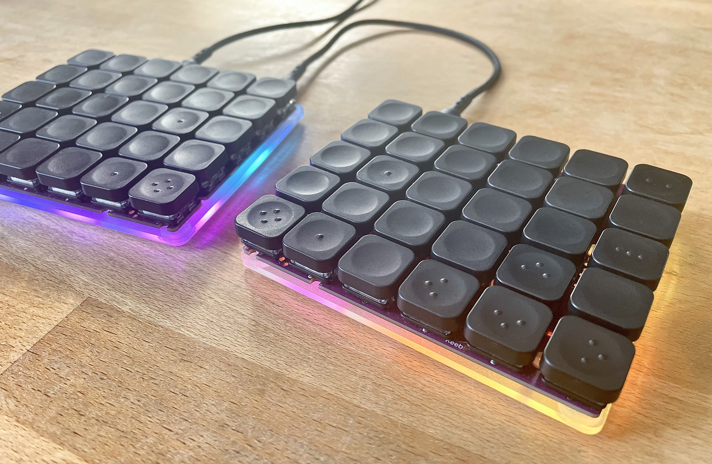

# Minimal Cases for Keebio Nyquist (rev 3.5)

This repo is to share designs for a minimalist case I made for my [Keebio Nyquist rev3.5](https://keeb.io/collections/nyquist-keyboard-collection/products/nyquist-keyboard). 

These plates are designed to attach to the internal screwpoints of the Nyquist, to make the most compact but useful package.

The outside corners are drawn with radii to match WorkLouder keycaps. This case should also work for other switches and keycaps, but I might adjust the outside dimension if I were to make it for other keycaps.
## Main file: Single Plate Design

I currently use `keebio-nyquist-plates-bottom-only.svg` as a bottom-plate-only case for my Nyquist.

I connect it to the PCB with 10mm screws, using little rubber feet as internal standoffs, and 3mm standoffs as nuts above the PCB. (I previously tried to use plastic washers as internal standoffs, but it was horribly fiddly to screw everything into place. So, the stick rubber feet look a little odd, but work much better.)

### Specifics

- The 10mm screws are ordered directly from Keebio, by emailing them.
- The 3mm standoffs were purchased through the normal Keebio website.
- The rubber feet came from Amazon: [HSIULMY Clear Rubber Bumpers Pads, 100 Pcs](https://www.amazon.com/gp/product/B07NJT6B88)
- The keyboard and its cables fit fairly nicely into this [Amazon Basics 5" GPS Travel Case](https://www.amazon.com/gp/product/B004I5BUSO) (it’s a bit snug and not completely rigid, but has worked well for me in a few road/airplane trips)
- For keycaps, I have tried both the [WorkLouder Blind](https://worklouder.cc/shop/wrk-blind/) and the [ChocFox CFX](https://chosfox.com/products/chocfox-cfx-choc-keycaps). I prefer the CFX ergonomically, because their slightly wider gaps make it easier to feel where my fingers are. However, the WorkLouder keycaps are more aesthetically pleasing to me, and they do have better homing key markers.

### Images

Nyquist with WorkLouder Blind Keycaps:


Nyquist with ChocFox CFX Keycaps. The white keys have been dyed gray with Rit DyeMore Graphite:


The total thickness is pleasantly low profile, at about 2cm. I don’t need a wrist rest for this, even though I do for a high-profile keyboard.


The bottom and side edges align nicely with the keycaps. (The top side aligns to USB-C connectors, to provide some protection.)



Underside view, showing rubber feet used as standoffs:


I used some fine-grit sandpaper to frost the inside surface of the plates, for improved RGB diffusion:


The plates have pre-cut spaces for the JST connector (so you don’t have to desolder it) and reset buttons (in case you need them!) I also currently use metal screws (ordered from Keebio as described above) whereas I formerly used nylon screws. The metal screws are lower profile and allow the rubber feet to keep good contact with the desk, whereas the nylon screws scratched the desk slightly and prevented sturdy contact.


These fit into an Amazon Basics 5" GPS Travel Case. The case is slightly more flexible than I’d like, but the package has proved sturdy enough so far.


## Experimental file: Sandwich Case

The file `keebio-nyquist-plates-with-middle-layer-EXPERIMENTAL.svg` is something I have also cut, but haven't yet put to use. I haven’t tested it yet, so it may not work well at all! Then again, I believe it could almost certainly work well without the middle layer.

It would act as a slightly more traditional acrylic case, including a top plate and sealed edges.

The idea is to glue the middle layer to the bottom plate, using acetone or superglue. I then would superglue 3mm standoffs into the holes of the top plate, to be able to screw on the bottom casing.

Notes:

- I have read that to use an acrylic top plate with choc switches requires soldering (rather than millmax hotswap sockets).
- This case design would have a slightly wider footprint than the simpler plate design, so it wouldn’t fit in the same carrying case.

If anyone happens to try this before I do, please let me know how it goes!

## Ordering

I ordered these as a laser cut from [Ponoko](http://ponoko.com), using the 1/8 inch frosted acrylic.

I used a fine-grit sandpaper to roughen the internal surface of the plates, to improve diffusion of lights.

But, to be honest, I don't always use the underglow lights now, so I would maybe order a different color if I were to order again.

## Suggestions

I wish I would have installed mill-max hotswap sockets, to allow me to more easily iterate on case designs with top plates. I now have to either order a second Nyquist, or desolder my original switches, if I want to test my experimental case design. What a pain!

If you make this, best of luck to you!

## PS: my current Nyquist keymap

Here’s [my current Nyquist keymap](https://github.com/arrowtype/qmk_firmware/blob/3c2cfd5964a2851b123c9dac7152d11af2e1ceb2/keyboards/keebio/nyquist/keymaps/hyper/keymap.c).

```
---------------------------------------------------   ---------------------------------------------------
| Esc/Adj | 1     | 2     | 3     | 4     | 5     |   | 6     | 7     | 8     | 9     | 0     | Bksp    |
|-------- ------- ------- ------- ------- ------- |   |-------------------------------------------------|
| Tab     | Q     | W     | E     | R     | T     |   | Y     | U     | I     | O     | P     | \       |
|-------- ------- ------- ------- ------- ------- |   |-------------------------------------------------|
| `       | A     | S     | D     | F     | G     |   | H     | J     | K     | L     | ;     | "       |
|-------- ------- ------- ------- ------- ------- |   |-------------------------------------------------|
| Shift   | Z     | X     | C     | V     | B     |   | N     | M     | ,     | .     | Up    | Ent/Shf |
|-------- ------- ------- ------- ------- ------- |   |-------------------------------------------------|
| Hyper   | Ctrl  | Alt   | Cmmd  | Lower | Space |   | Space | Raise | /     | Left  | Down  | Right   |
---------------------------------------------------   ---------------------------------------------------
```

It arranges arrow keys in the traditional “inverted T” for easy use in design apps, etc, and moves the **/** key to a thumb position, to allow for this. It feels odd at first, but not as odd as single-row arrow keys, to me.

Additionally, it makes use of some neat QMK features:

- The `Enter` key doubles as a `Shift` key, when held down
- The `Escape` key doubles as the `Adjust` layer key, when held down, useful for adjusting RGBs, layouts, and rebooting the PCBs
- The very bottom left key acts as a `Hyper` key (Shift+Control+Option+Command), so you can easily create keyboard shortcuts without conflicts.
- The `/` key acts as a `Command` key, when held down, for easy one-handed use of common shortcuts like Command+P (print), Command+Enter (send email/message), and Command+Up/Down (to navigate folder levels in Finder).
